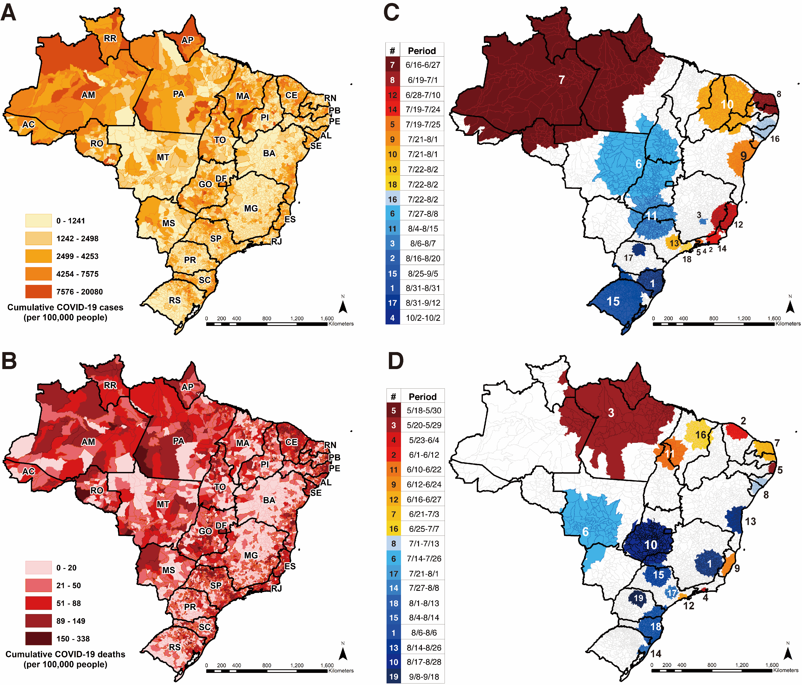

# Spatiotemporal pattern of COVID-19 spread in Brazil 

 
 
 
# Introduction
Here we provide the data and pipeline for: [Spatiotemporal pattern of COVID-19 spread in Brazil](https://science.sciencemag.org/content/early/2021/04/13/science.abh1558)

### Citation

> Castro MC, Kim S, Barbeira L, et al. Spatiotemporal pattern of COVID-19 spread in Brazil. *Science*. 2021. DOI: 10.1126/science.abh1558

# Abstract

Brazil has been severely hit by COVID-19, with rapid spatial spread of both cases and deaths. We use daily data on reported cases and deaths to understand, measure, and compare the spatiotemporal pattern of the spread across municipalities. Indicators of clustering, trajectories, speed, and intensity of the movement of COVID-19 to interior areas, combined with indices of policy measures show that while no single narrative explains the diversity in the spread, an overall failure of implementing prompt, coordinated, and equitable responses in a context of stark local inequalities fueled disease spread. This resulted in high and unequal infection and mortality burdens. With a current surge in cases and deaths and several variants of concern in circulation, failure to mitigate the spread could further aggravate the burden.

__One Sentence Summary:__ The spread of COVID-19 cases and deaths in Brazil exposes the failure to control the epidemic resulting in a high and unequal burden across the country.

__Fig. 1 Spatial distribution and clustering of reported COVID-19 cases and deaths.__
*Cumulative number of COVID-19 cases (__A__) and deaths (__B__) per 100,000 people by municipality. Dark lines on the maps show state boundaries. State acronyms by region, North: AC=Acre, AP=Amapá, AM=Amazonas, PA=Pará, RO=Rondônia, RR=Roraima, and TO=Tocantins; Northeast: AL=Alagoas, BA=Bahia, CE=Ceará, MA=Maranhão, PB=Paraíba, PE=Pernambuco, PI=Piauí, RN=Rio Grande do Norte, and SE=Sergipe; Center-west: DF=Distrito Federal, GO=Goiás, MT=Mato Grosso, and MS=Mato Grosso do Sul; Southeast: ES=Espírito Santo; MG=Minas Gerais; RJ=Rio de Janeiro; and SP=São Paulo; South: PR=Paraná; RS=Rio Grande do Sul; and SC=Santa Catari-na. Spatio-temporal clustering of cases (__C__) and deaths (__D__) across Brazilian municipalities. Color and number codes in the clusters and the table on the left are the same, and the table indicates the interval during which each cluster was statistically significant. The color gradient (dark red to dark blue) indicates the temporal change based on the initial date of the cluster, and the cluster number indicates the rank of the relative risk for each cluster (__Tables S2 and S3__). Clusters were assessed with the space-time scan statistic (see supplementary materials).* 

# Organization
We have organized this repo by method. Within each of the methods folders are separate `code`, `data`, and `README.md` files. For additional information see the `README.md` files for each method: 
- `1_spatiotemporal`  — the spatiotemporal clusters analysis.
- `2_geographical_center`  — the geographical center analysis. (Includes supplementary .gif files)
- `3_hoover` —  the Locational Hoover Index.
- `4_policy_response ` - the policy response indicators
- `5_social_distancing ` - the social distancing index
- `6_correlations` — the Pearson correlations
- `7_cluster` - the hierarchical cluster analysis
- `Figures` - All figures from the main document 

# Correspondence
For any issues with anonymization or major issues with the functionality of the script please [create an issue](https://github.com/mcastrolab/Brazil_Covid19_spatiotemporal/issues).

## License
The data collected and presented is licensed under the [Creative Commons Attribution 4.0 license](https://creativecommons.org/licenses/by/4.0/), and the underlying code used to format, analyze and display that content is licensed under the [MIT license](http://opensource.org/licenses/mit-license.php). 

# Authors

- __Marcia C Castro__: Department of Global Health and Population, Harvard TH Chan School of Public Health | : [\@marciacastrorj](https://twitter.com/marciacastrorj)
- __Sun Kim__: Department of Global Health and Population, Harvard TH Chan School of Public Health | : [\@SunKim0710](https://twitter.com/SunKim0710) 
- __Lorena Barberia__: Department of Political Science, University of São Paulo (USP), Sao Paulo, SO, Brazil | : [\@lorenagbarberia](https://twitter.com/lorenagbarberia) 
- __Ana Freitas Ribeiro__: Universidade Nove de Julho, São Paulo, SP, Brazil; Universidade Municipal de São Caetano do Sul, São Cetano do Sul, SP, Brazil.
- __Susie Gurzenda__: Department of Global Health and Population, Harvard TH Chan School of Public Health | : [\@susiegurzenda](https://twitter.com/susiegurzenda)
- __Karina Braga Ribeiro__: Faculdade de Ciências Médicas da Santa Casa de São Paulo, Department of Collective Health, São Paulo, SP, Brazil | : [\@kbribeiro](https://twitter.com/kbribeiro)
- __Erin Abbott__: Center for Geographical Analysis, Harvard University, Cambridge, MA, USA. | : [\@Erin_Abbott1](https://twitter.com/Erin_Abbott1) 
- __Jeffrey Blossom__: Center for Geographical Analysis, Harvard University, Cambridge, MA, USA. |  : [projects.iq.harvard.edu/jeffblossom](https://projects.iq.harvard.edu/jeffblossom/home)
- __Beatriz Rache__: Instituto de Estudos para Políticas de Saúde (IEPS), São Paulo, SP, Brazil | : [\@beatrizrache](https://twitter.com/beatrizrache) 
- __Burton H Singer__: Emerging Pathogens Institute, University of Florida, Gainesville, FL, USA

## Repository at time of publication
This repository is continually updated for clarity in response to feedback. However, all code will remain public and reproducible.

For full transparency, we include what the respository looked like at the time of journal submission. Thus, the [First release](https://github.com/mcastrolab/Brazil_Covid19_spatiotemporal/releases) is the version of the repository that existed at the time of submission. This release is archived on Zenodo:

